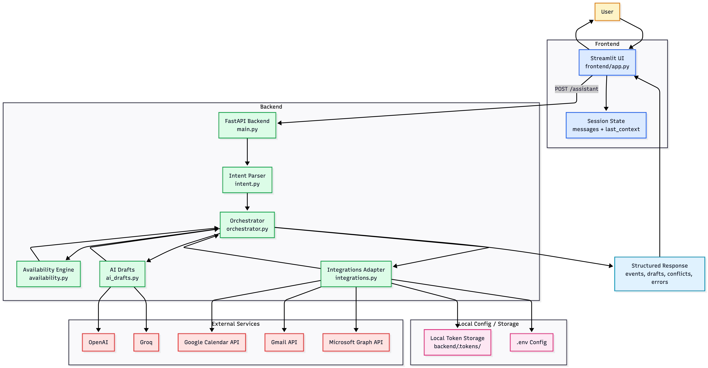
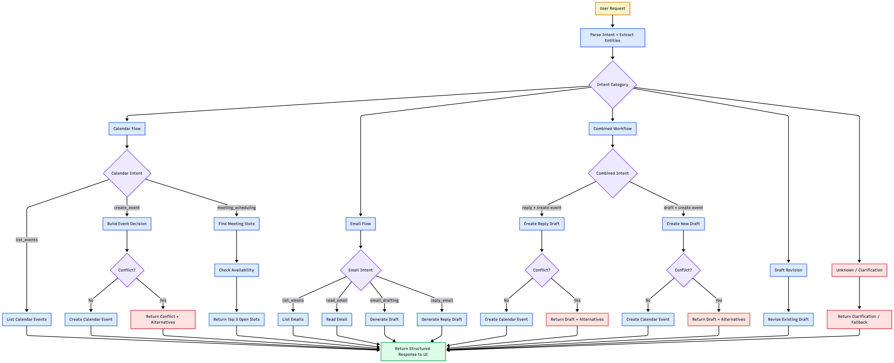

# ExecAI -- Executive Assistant (MVP)

ExecAI is an end-to-end intelligent assistant that interprets natural language requests and coordinates common executive tasks such as scheduling meetings, drafting professional emails, checking availability, and replying to messages.

The project focuses on the architecture of intelligent assistants, especially intent detection, orchestration logic, conflict-aware decision making, and integration with external services. Rather than centering on complex model training, ExecAI emphasizes clear system design, reliable task execution, graceful fallback behavior, and transparent reasoning.

------------------------------------------------------------------------

## Overview

ExecAI allows a user to interact with an assistant through natural language. The assistant interprets the request, extracts structured information, determines the appropriate action, and executes the task through integrated services.

Example requests include:

- Find a time for all four of us to meet tomorrow
- Email Sarah the invoice professionally
- Reply to my latest email and schedule a meeting
- Show my calendar for next week
- Draft an email to a colleague about a proposal

Each request is processed through several stages:

1. Intent detection and entity extraction
2. Decision making through an orchestration layer
3. Conflict checking or draft generation when needed
4. Execution through the appropriate provider integration
5. Returning structured results to the user interface

------------------------------------------------------------------------

## System Architecture

The system is composed of a lightweight user interface and a backend service responsible for interpreting requests and coordinating actions.



### Frontend

The frontend is implemented using Streamlit. It provides a conversational interface where users can submit requests and view results returned by the assistant.

The interface also includes a debugging panel that can expose internal reasoning such as detected intents, extracted entities, and orchestration decisions. It stores conversation history and lightweight follow-up context in session state so the user can revise drafts with requests such as “make it shorter” or “more formal.”

### Backend

The backend is implemented with FastAPI. It exposes API endpoints that receive user requests and coordinate assistant operations.

The backend is responsible for:

- Processing requests
- Detecting intents
- Extracting entities
- Orchestrating actions
- Checking availability and conflicts
- Generating drafts and replies
- Communicating with external services
- Returning structured responses to the frontend

### Intent Parser

The intent parser analyzes user input and determines the user's goal. It extracts structured information such as:

- Participants
- Timeframes
- Topics
- Email tone
- Email recipients
- Event titles
- Duration

ExecAI uses a hybrid parsing strategy. When an LLM is configured, the parser uses it to improve interpretation of ambiguous or compound requests. When LLM services are unavailable, the system falls back to rule-based parsing so the assistant still produces a usable result.

### Orchestrator

The orchestrator acts as the decision engine of the assistant. Based on the detected intent and extracted entities, it determines which action should be executed and which integration should be invoked.

This component ensures that different capabilities such as email, scheduling, conflict detection, and combined workflows are handled through a unified decision layer.

### Availability Engine

The availability module evaluates calendar availability and detects scheduling conflicts. When a requested meeting time is unavailable, the system generates alternative meeting slots.

### AI Draft Generation

The draft-generation module creates new email drafts, contextual replies, and draft revisions. It supports a three-tier strategy:

- OpenAI as the primary LLM path
- Groq as a fallback LLM path
- Rule-based templates as a final fallback

This allows the system to continue working even when one provider is unavailable.

### Service Integrations

ExecAI integrates with external services in order to execute actions:

- Google Calendar API for event creation, event listing, deletion, and availability checks
- Gmail API for reading emails, generating drafts, replies, and sending emails
- Microsoft Graph API for Outlook calendar and mail operations
- Google OAuth 2.0 for secure account connection
- Microsoft OAuth 2.0 for secure account connection

------------------------------------------------------------------------

## Execution Flow

The following diagram illustrates how a request moves through the system.


A typical interaction proceeds as follows:

1. The user submits a request through the Streamlit interface.
2. The frontend sends the request to the FastAPI backend.
3. The intent parser analyzes the request and extracts structured data.
4. The orchestrator determines the required action.
5. The availability module checks for conflicts when scheduling.
6. The draft generator or integration layer performs the required action.
7. The result is returned to the frontend and displayed to the user.

------------------------------------------------------------------------

## Agent Decision Flow

The assistant uses a decision flow that routes requests depending on the detected intent. This ensures that each user request is handled by the appropriate workflow.



The decision flow includes:

- Calendar actions such as listing events, creating events, and finding availability
- Email actions such as listing emails, reading messages, drafting emails, and replying
- Combined workflows such as replying to an email and scheduling a meeting
- Combined workflows such as drafting an email and creating a meeting
- Draft revision flows for follow-up editing
- Fallback responses when the intent cannot be determined

------------------------------------------------------------------------

## Supported Capabilities

### Calendar

- List upcoming events
- Create calendar events
- Delete calendar events
- Detect scheduling conflicts
- Suggest alternative meeting times
- Check free/busy availability

### Email

- List recent emails
- Read email content
- Draft new emails
- Generate reply drafts
- Revise drafts through follow-up instructions
- Send emails from the UI
- Reply to emails and schedule meetings
- Draft an email and create a meeting in one flow

### UI / Demo Features

- Google OAuth connect flow from the Streamlit sidebar
- Microsoft OAuth connect flow from the Streamlit sidebar
- Connection status indicators
- Demo panel for upcoming meetings
- Demo panel for free time tomorrow
- Demo panel for quick draft creation
- Chat-based assistant interface for natural language requests
- Editable draft review area before sending
- Debug panel for transparent inspection of system decisions

------------------------------------------------------------------------

## Transparency and Debugging

ExecAI includes an optional debugging panel that exposes the assistant’s internal reasoning. This allows developers to inspect:

- Detected intent
- Extracted entities
- Orchestrator decisions
- Execution results

This transparency helps ensure that the system remains understandable, debuggable, and traceable during development and testing.

------------------------------------------------------------------------

## Technology Stack

### Backend

- Python
- FastAPI
- Pydantic
- requests
- python-dotenv

### Frontend

- Streamlit

### AI / NLP

- OpenAI API
- Groq API
- Rule-based parsing and template fallbacks

### Integrations

- Gmail API
- Google Calendar API
- Microsoft Graph API
- OAuth 2.0 for Google and Microsoft

------------------------------------------------------------------------

## Project Structure

```text
execai/
│
├── backend/
│   ├── main.py
│   ├── orchestrator.py
│   ├── intent.py
│   ├── availability.py
│   ├── ai_drafts.py
│   ├── integrations.py
│   └── .tokens/
│
├── frontend/
│   └── app.py
│
├── docs/
│   ├── execai_system_architecture.png
│   ├── execai_sequence_diagram.png
│   ├── execai_decision_flow.png
│   └── ExecAI_Capstone_Poster.pdf
│
├── .env
├── requirements.txt
└── README.md
```

------------------------------------------------------------------------

## Local Setup

### 1. Clone the repository

```bash
git clone <YOUR_REPOSITORY_URL>
cd execai
```

### 2. Create a virtual environment

#### macOS / Linux

```bash
python3 -m venv venv
source venv/bin/activate
```

#### Windows

```bash
python -m venv venv
venv\Scripts\activate
```

### 3. Install dependencies

If a `requirements.txt` file is available:

```bash
pip install -r requirements.txt
```

Otherwise install the required packages manually:

```bash
pip install fastapi uvicorn streamlit openai pydantic requests python-dotenv
```

------------------------------------------------------------------------

## Environment Variables

Create a `.env` file in the root of the project:

```env
GOOGLE_CLIENT_ID=your_google_client_id
GOOGLE_CLIENT_SECRET=your_google_client_secret
GOOGLE_REDIRECT_URI=http://127.0.0.1:8000/integrations/google/callback

MICROSOFT_CLIENT_ID=your_microsoft_client_id
MICROSOFT_CLIENT_SECRET=your_microsoft_client_secret
MICROSOFT_TENANT_ID=common
MICROSOFT_REDIRECT_URI=http://localhost:8000/integrations/outlook/callback

OPENAI_API_KEY=your_openai_api_key
GROQ_API_KEY=your_groq_api_key
```

### Notes

- `GOOGLE_REDIRECT_URI` must exactly match the redirect URI configured in your Google Cloud OAuth settings.
- `MICROSOFT_REDIRECT_URI` must exactly match the redirect URI configured in your Microsoft Azure app settings.
- The `.env` file should remain local and should not be committed to GitHub.
- Team members who want to test locally need their own `.env` file with valid credentials.

------------------------------------------------------------------------

## OAuth Setup

To use Gmail, Google Calendar, and Outlook integrations, the project must be connected to OAuth applications for the supported providers.

### Google OAuth Setup

1. Create or use an existing Google Cloud project
2. Enable:
   - Gmail API
   - Google Calendar API
3. Configure the OAuth consent screen
4. Add test users if the app is still in testing mode
5. Add the redirect URI:

```text
http://127.0.0.1:8000/integrations/google/callback
```

If the OAuth app is in testing mode, only users added under Google OAuth **Test Users** can authorize the app.

### Microsoft OAuth Setup

1. Create or use an Azure app registration
2. Enable the required Microsoft Graph permissions for mail and calendar
3. Configure the redirect URI:

```text
http://localhost:8000/integrations/outlook/callback
```

4. Use `common` as the tenant ID when testing with personal accounts, if applicable

------------------------------------------------------------------------

## Running the App Locally

### Start the backend

From the project root:

```bash
uvicorn backend.main:app --reload
```

The backend will run at:

```text
http://127.0.0.1:8000
```

### Start the frontend

Open a second terminal in the same project root and run:

```bash
streamlit run frontend/app.py
```

The frontend will run at:

```text
http://localhost:8501
```

------------------------------------------------------------------------

## Connecting an Account

Once both backend and frontend are running:

1. Open the Streamlit UI
2. In the sidebar, click **Connect Google** or **Connect Outlook**
3. Follow the provider authorization flow
4. After authorization, the callback page will confirm that the account was connected
5. Return to the app and continue testing

After a successful connection, ExecAI can use the connected user’s email and calendar services.

------------------------------------------------------------------------

## Example Prompts

### Calendar

- Show my calendar for next week
- Create a meeting with sarah@example.com tomorrow at 11am
- Schedule a budget review with sarah@example.com and john@example.com tomorrow at 2pm for 45 minutes
- Find a time for all four of us to meet tomorrow

### Email

- Show my latest emails
- Read my latest email
- Reply to my latest email saying "Thanks for the update"
- Draft an email to sarah@example.com about the proposal

### Combined Workflows

- Reply to my latest email saying "I am available tomorrow at 2pm" and create the meeting
- Draft an email to sarah@example.com saying "I am available tomorrow at 2pm" and create the meeting

### Draft Revision

- Make it shorter
- Make it more formal
- Rewrite it in a friendlier tone

------------------------------------------------------------------------

## Demo Workflow

A simple demo flow for presenting the project:

1. Connect a Google or Outlook account from the sidebar
2. Show upcoming meetings
3. Check free time tomorrow
4. Create a draft from the quick demo panel
5. Use the assistant chat for:
   - scheduling
   - email drafting
   - email replies
   - combined workflows
   - follow-up draft revision

------------------------------------------------------------------------

## Main Endpoints

### Assistant / Core

- `GET /health`
- `POST /parse-intent`
- `POST /assistant`

### Integrations

- `GET /integrations/status`
- `GET /integrations/{provider}/auth-url`
- `GET /integrations/{provider}/callback`
- `POST /integrations/{provider}/list-events`
- `POST /integrations/{provider}/create-event`
- `DELETE /integrations/{provider}/delete-event/{event_id}`
- `POST /integrations/{provider}/freebusy`
- `GET /integrations/{provider}/list-emails`
- `GET /integrations/{provider}/read-email/{message_id}`
- `POST /integrations/{provider}/create-draft`
- `POST /integrations/{provider}/create-reply-draft`
- `POST /integrations/{provider}/send-email`

------------------------------------------------------------------------

## Development Notes

- OAuth tokens are stored locally in `backend/.tokens/`
- The project currently targets local development and demo use
- The assistant supports hybrid intent parsing with fallback behavior
- The draft generator supports OpenAI, Groq, and template fallbacks
- The system is designed so the orchestrator remains provider-agnostic
- Follow-up draft revisions rely on lightweight session context rather than persistent memory

------------------------------------------------------------------------

## Troubleshooting

### A provider is not connected

- Check that the backend is running
- Check that the `.env` file exists
- Check that OAuth credentials are correct
- Reconnect using the sidebar button

### Redirect URI mismatch

Make sure the redirect URI in the provider configuration exactly matches the value used in the `.env` file.

### Access denied during login

- For Google, make sure the email is included in OAuth **Test Users** if the app is still in testing mode
- For Microsoft, make sure the app registration and tenant settings allow the target account type

### Calendar or email requests fail

- Make sure the account was connected successfully
- Make sure the relevant APIs are enabled
- Make sure the required OAuth scopes were granted
- Reconnect the account if the token has expired or been revoked

### LLM-dependent features fail

- Check that `OPENAI_API_KEY` or `GROQ_API_KEY` is configured
- If no AI credentials are available, the rule-based fallback should still allow partial functionality

------------------------------------------------------------------------

## Future Improvements

Potential extensions for the system include:

- Cloud deployment for multi-user access
- Persistent preferences and cross-session memory
- Multi-user authentication and team calendar support
- More advanced natural language understanding
- Additional provider integrations
- Proactive reminders and notifications
- Improved production credential handling
- Better shared testing and deployment workflows

------------------------------------------------------------------------

## Status

ExecAI demonstrates a functional intelligent assistant architecture with intent detection, decision orchestration, draft generation, conflict-aware scheduling, and integration with real calendar and email services.

The current MVP supports Google and Microsoft integrations, local OAuth connection from the UI, conflict-aware event creation, AI-assisted drafting, follow-up revision, and natural language workflows across email and scheduling.